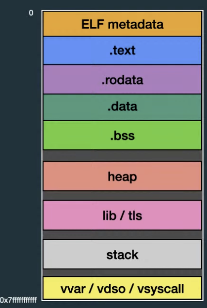
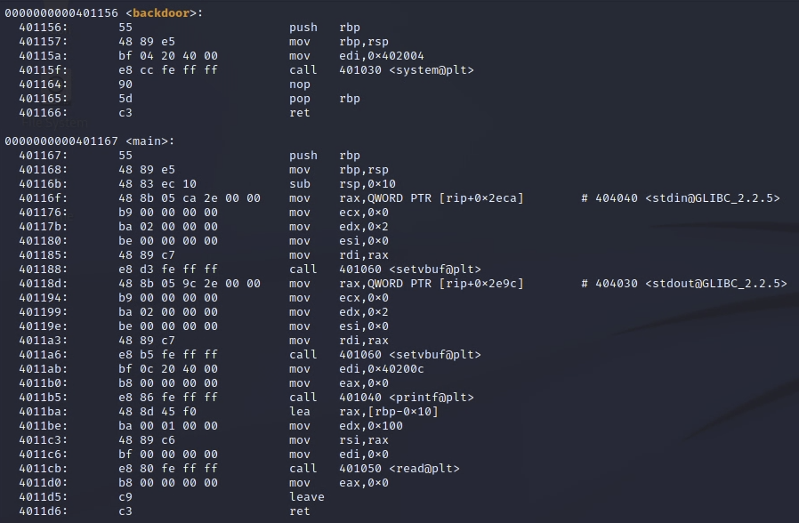
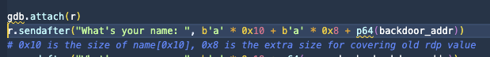
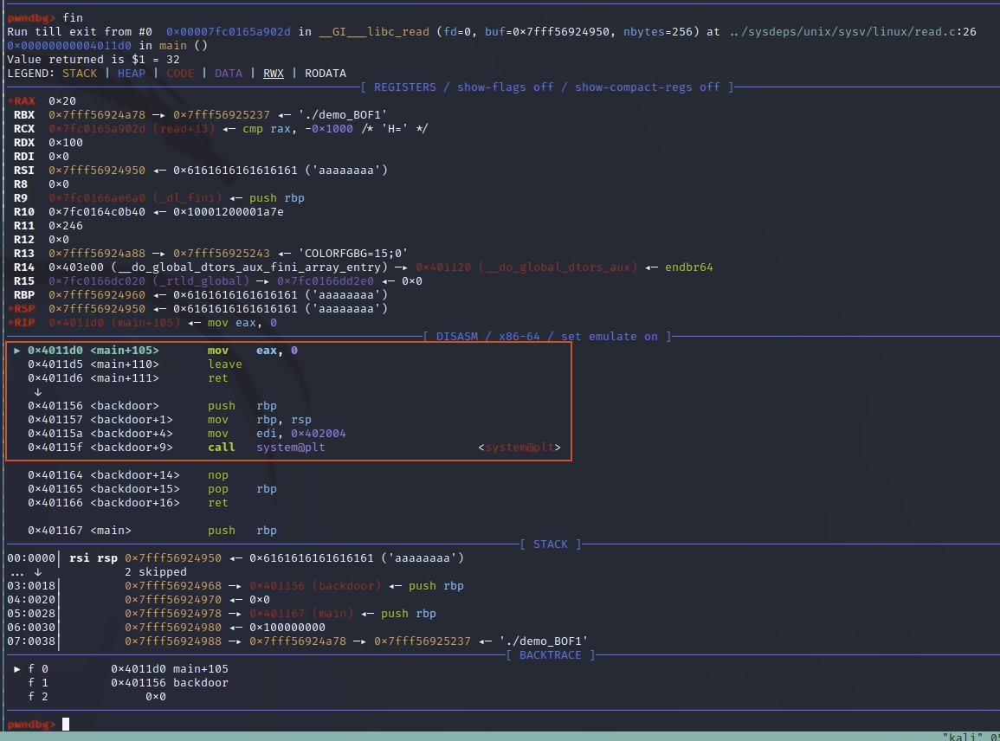
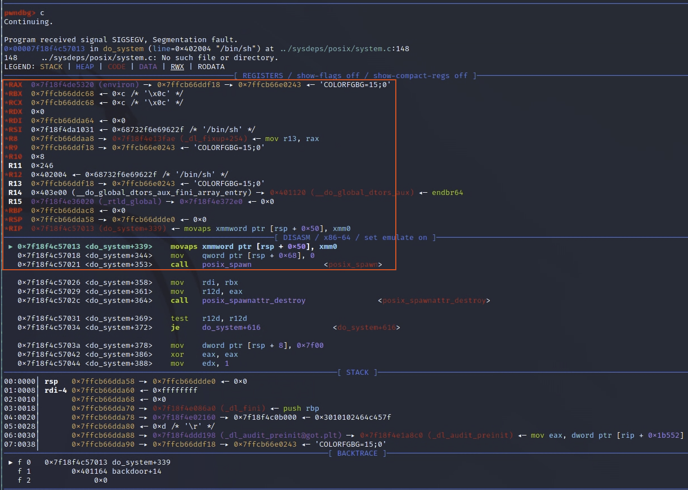
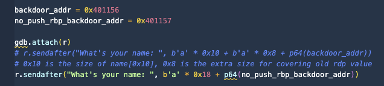
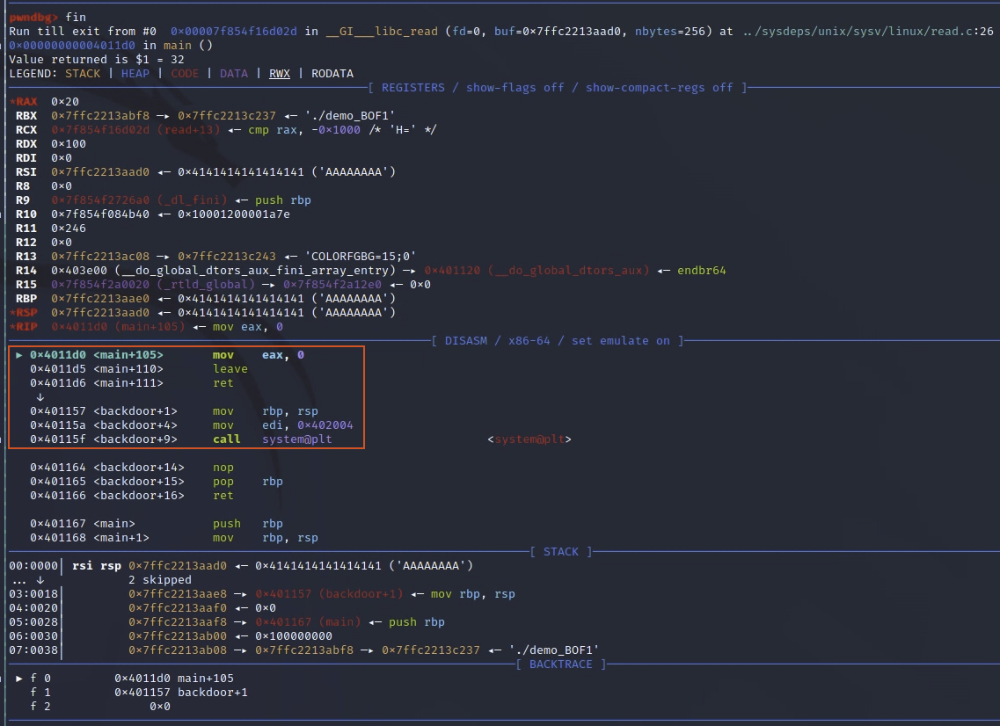
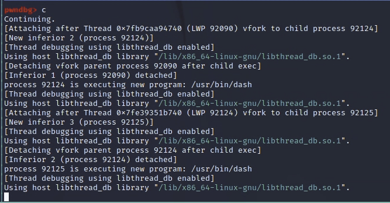

# 2022 Computer Security - PWN

* 這個紀錄是關於 PWN 的課程 demo 還有知識點。

## Basic Information

* **E**xecutable and **L**inkable **F**ormat, ELF - Linux 中的執行檔
    * Segment & Section
        * Section - 告訴 Linker 動態連結時所需要的資料
            * 用來區分不同功能的資料，因為不同功能會需要不同的**權限**、**大小**
                * 程式碼屬於 .text section，會需要**執行權限**
                * 常數字串屬於 .rodata section，只需要**讀取權限** 
        * Segment - 告訴 OS 程式被載入時的資訊
    * Memory Layout
        * `.text` - 程式碼
        * `.rodata` - read-only data，如字串
        * `.data` - 初始化後的變數
        * `.bss` - 上未初始化的變數
        * `heap` - 動態分配的記憶體空間
        * `lib` - shared library
        * `tls` - thread local storage
        * `stack` - 用來儲存當前 function 的執行狀態的空間
        > 
    * Protection
        * **P**osition-**I**ndependent **E**xecutable, PIE - 程式碼會以相對位置的方式表示，而非絕對位置
        * **N**o-e**X**cute, NX - `.text` 之外的 section 不會有執行權限
        * stack protector, Canary - 在 stack 的結尾塞入一個**隨機數**，return 前透過檢查是否有被修改來判斷執行是否出現問題
        * **REL**ocation **R**ead-**O**nly, RELRO - 分成 Full / Partial / No 三種型態，分別代表在 runtime 解析外部 Function 時使用的不同機制
        * **Sec**cure **comp**uting mode, Seccomp - 制定規則來禁止 / 允許呼叫特定的 syscall
        * **A**ddress **S**pace **L**ayout **R**andomization, ASLR - 程式載入時，stack / heap 等記憶體區塊會使用隨機的位址作為 base address
            * 在一定範圍內隨機，且 **末 12 bits** 是固定的，每次載入不會更動

## BOF

* Mitigation - canary (stack guard)
    * 啟用 canary 後，OS 會在載入程式時，在 TLS 當中 offset `0x28` 的位置，放置 8 bytes 的隨機數，該值就稱作 canary。
    * 當程式執行到 `ret` 時，會先檢查 stack 上的 canary 是否被修改 (跟 TLS 記憶體的值是否相同)，如果被修改 (代表發生 stack overflow)，則會直接結束程式。
    * 但因為 canary 的第一個 byte 必定為 00，所以可以利用這個特性來 bypass canary。
    * fs register - 用來存放 TLS 的 base address，雖然存取 fs 取得 TLS address 是 OS 做的，本身 fs 的值是 0，因此 TLS 的位址並不是那麼好找，但因為 runtime 時 TLS 與 lib 在 **多數情況下** 有固定的 offset，因此可以透過 debugging 取得 offset，打 exploit 時就可以直接利用加減 offset 來取得 TLS address。
    * gdb debugging 時，取得 TLS address 的方法有:
        * `pwndbg> tls`
        * `pwndbg> search -8 <canary>`
        <!-- * `pwndbg> x/8gx $fs:0x28` -->
        > canary 的值可以透過查看 function prologue 跟 epilogue 來找到，或是直接用 pwndbg 中下 canary 也可以。
        

## Demo

### Demo 1 - Basic Stack Overflow `demo_BOF1`

> Env: `gcc -o demo_BOF1 -fno-stack-protector -fno-pie -no-pie demo_BOF1.c` 用來關閉 stack protector 與 PIE]

* `demo_BOF1`: 目標碰到 `backdoor()` 這個 function，可以先用 `objdump -d -M intel ./demo_BOF1 | less` 來觀察找到 `backdoor` function 的所在位置，可以看到位置是在 `0011c9`，把 return address 控制成目標的 `401156` 就可以操作到 backdoor function 了，
    > 
* 利用 `b'a' * 0x10` 來覆蓋掉 `name[0x10]` 的 space，並且把 `return address` 覆蓋成 `backdoor` 的位址，就可以成功執行 `backdoor` 了
    > 
* 從 gdb 的操作中可以看到我們已經成功進入 `backdoor` function 並且 load 到 `system('/bin/sh')` 了，但這邊會發現指令並沒有被正常執行
    > 
    > 
* 原因是因為我們觸發了 glibc rsp 16 bytes 對其問題，在 64 bits 環境下，有些 glibc 版本會預設 stack 位址 要對齊 16 bytes，意即 rsp 的值要能被 16 整除 ，rsp 最後一碼必須為 0。針對這個問題其實目標就是去 +8 or -8 讓 stack 去對齊 0x10，而只要我們略過 `push rbp` 就可以達成這個目的，因為原本的 rbp 跟 rsp 是有對其的，我只要避免 `push rdp` 影響到了這個對其，其實就達到要求了。
    > 
    > 
    > 
